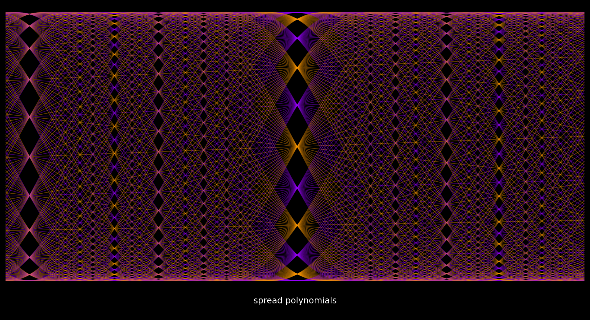

# Welcome to the Wild Egg Polynumbers Project

Inspired by the lectures of [Dr. Norman J. Wildberger](https://www.youtube.com/c/njwildberger) on his [Wild Egg Maths](https://www.youtube.com/c/WildEggmathematicscourses) channel, we are on a quest for patterns within the realms of mathematical structures.

The primary mission of the Polynumbers project is to model, analyze and render properties and attributes of recursive polynomials series.

We are building a foundational set of tools in Python for this exploration, leveraging the power of libraries like [Sympy](sympy.org) and [Matplotlib](matplotlib.org)

